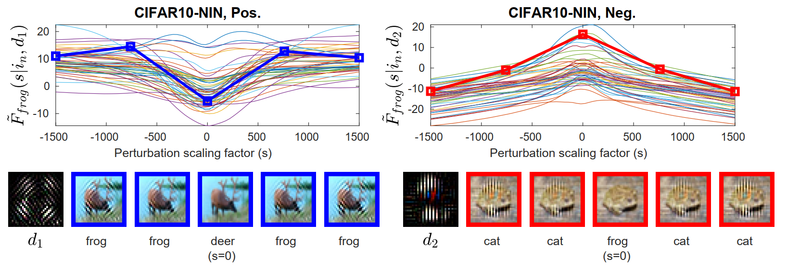

# With Friends Like These, Who Needs Adversaries?

Code implementing the experiments described in the NeurIPS 2018 paper "With Friends Like These, Who Needs Adversaries?", by Saumya Jetley*, Nicholas A. Lord*, and Philip H.S. Torr.  

Our study illustrates some fundamental connections between how nets classify and how they're vulnerable to adversarial attack.
`d1` and `d2` above are sample adversarial directions or, correspondingly, the directions associated with the idenitification of classes `frog` and `cat` respectively.
Watch the [brief video](https://www.youtube.com/watch?v=hOQdyInhYi0), and read the [paper](https://papers.nips.cc/paper/8273-with-friends-like-these-who-needs-adversaries) to learn more about our exposition. 

## Attributions

- Includes two MNIST loader files, `loadMNISTLabels.m` and `loadMNISTImages.m`, downloaded [here](http://ufldl.stanford.edu/wiki/resources/mnistHelper.zip).
- Includes a version of DeepFool with a one-line modification to implement subspace confinement as described in the paper: see the two files in the `projected_DeepFool` subproject folder. The modification is noted in the source files, whose original authorship is as detailed in those files.
The original repository version is [here](https://github.com/LTS4/DeepFool/tree/master/MATLAB).  
The associated publication is "DeepFool: a simple and accurate method to fool deep neural networks"; by Seyed-Mohsen Moosavi-Dezfooli, Alhussein Fawzi, and Pascal Frossard; in CVPR 2016.
- The `curvature_analysis_matconvnet` subproject is based on research code provided personally by Seyed-Mohsen Moosavi-Dezfooli and Alhussein Fawzi. It has been ported to use MatConvNet, and utility functions have been reimplemented. It otherwise contains light modifications, but the essential functionality is preserved. See comments in the source.  
This subproject pertains to the paper "Robustness of Classifiers to Universal Perturbations: A Geometric Perspective"; by Seyed-Mohsen Moosavi-Dezfooli*, Alhussein Fawzi*, Omar Fawzi, Pascal Frossard, and Stefano Soatto; in ICLR 2018. That work should be cited if this subproject or anything that depends on it is used.

## Required Setup

- This code is written in MATLAB, using MatConvNet. Your MATLAB version must be R2015b or newer to support MatConvNet.
- Install MatConvNet according to its own directions. As of this writing, these are [here](http://www.vlfeat.org/matconvnet/install/). Note that this requires a compiler with C++11 support (visible on the system path). If intending to use GPU support (highly recommended), follow the directions to enable this.
- Download all datasets that will be tested against: MNIST, CIFAR10, CIFAR100, ImageNet.
- Edit the file `WFLTWNA_setup.m` to provide the paths to MatConvNet and the parent directory of this project on your machine, then run it.

## User-Facing Utility Files

- **utilities/data_loaders/load_XXX**: The four provided files each load their respective (bespoke) datasets in a format that can then be used consistently by the rest of the code. The only input is the path to the dataset's main directory.

- **utilities/load_network**: A loader for any MatConvNet simpleNN net file which takes the path to the net, and, optionally, a string specifying the "type" of network it is (i.e. the dataset it was trained on), to potentially perform additional cleanup on it accordingly. See the source.  
Note that while this loader leaves the network intact, the main project files generally expect a network with its final layer removed, which can be accomplished with the single following line:  
`net.layers(end) = [];`

- **utilities/construct_S**: This is used to process the output structure from `boundary_curvatures_all_targets` into a semi-orthogonal basis suitable for analysis by `net_accuracy_vs_data_projection`. The results of the paper can be replicated via different choices of input values and options. See comments below, and in the file itself.

## Subproject Main Files

- **curvature_analysis_matconvnet/boundary_curvatures_all_targets**: Takes a net and dataset and gives you the principal directions and curvatures of the decision boundary, for all of the one-v-all binarisations of the problem. See the paper for more specifics and explanations of the significance of this analysis.

- **first_order_analysis/svd_deepfool_pert**: Loads a collection of DeepFool perturbations and produces the singular value decomposition of their normalised matrix. In other words, it produces the first-order analogue (on this problem) of the outputs of `boundary_curvatures_all_targets`, but there is no "one-v-all" notion: it's the most important decision directions generally.

- **projected_DeepFool/adversarial_ProjectedDeepFool_matconvnet**: A DeepFool main file (given a net and an input point, returns the DeepFool perturbation plus some stats), with the modification that it also accepts a basis defining the subspace in which the attack will take place.

## Main Experiment Files

- **experiments/net_accuracy_vs_data_projection**: Given a dataset, net, (semi-orthogonal) basis, and the number n of (leftmost) basis vectors to retain, computes the net's accuracy statistics for the restriction of the data to the subspace spanned by those n basis vectors.  
In the context of this work, there are two basic ways that the basis onto which the data will be projected is generated:  
(1) The first-order version: Use `first_order_analysis/svd_deepfool_pert`, as directed above. The output matrix `V` can be used directly as the basis.  
(2) The second-order (curvature-based) version: First use `curvature_analysis_matconvnet/boundary_curvatures_all_targets` to generate a result structure which represents the principal direction and curvatures of the one-v-all binary decision boundaries of the net. Then input this structure to `utilities/construct_S` as the parameter `curvature_info`, along with two other parameters: the number of vectors to be retained from each one-v-all target class (`vectors_per_class`), and the way in which those vectors are to be chosen (`selection_strategy`). Possible values of selection_strategy are `'first'`, `'last'`, `'most'`, `'least'`, and `'first_and_last'`, as used in the paper and as defined in `utilities/construct_subspace_basis`. The output of `construct_S` can then be used as the basis. Typically, in this context, it will be appropriate to pass `size(basis, 2)` as the value of `n` in the call to `net_accuracy_vs_data_projection`, such that the entire basis is used in each call. Controlling the subspace is done via changes to the calls to `construct_S` in the second-order case.

- **experiments/deepfool_projected**: Given a dataset, net, and (semi-orthogonal) basis matrix, computes the "confined DeepFool" at every sample image in the dataset, where the confinement of the attack is to the space spanned by the provided basis.  
**experiments/deepfool_projected_vs_subspace**: A wrapper around `deepfool_projected` which repeats its analysis for different subspaces of the supplied basis. Given a dataset, a net, a semi-orthogonal basis matrix with a corresponding diagonal matrix of "scores" of the basis vectors (e.g. singular vectors and singular values), and a vector of subspace dimensions, runs `deepfool_projected` on each subset of the basis specified by the vector of dimensions and different orderings of the supplied scores.  

- **experiments/subspace_component_norms**: Given a collection of vectors (e.g. adversarial attacks) as columns of a matrix, a semi-orthogonal basis matrix and a corresponding diagonal score matrix, a vector of subspace dimensions, and a method for ordering the basis vectors by their scores, outputs the norms of the projections of the input vectors onto each subspace defined by the basis, the dimension, and the ordering, as a fraction of the original norm (i.e. the norm of the projection of the corresponding unit-norm direction vector).

